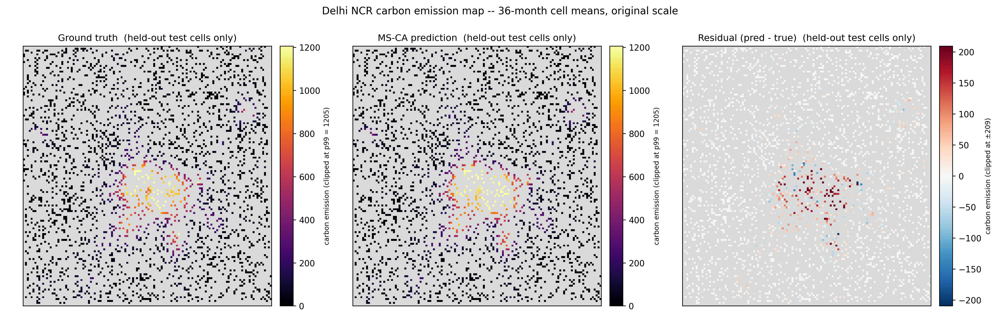
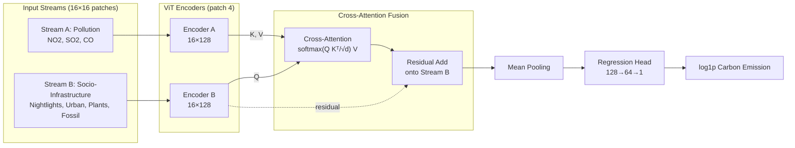
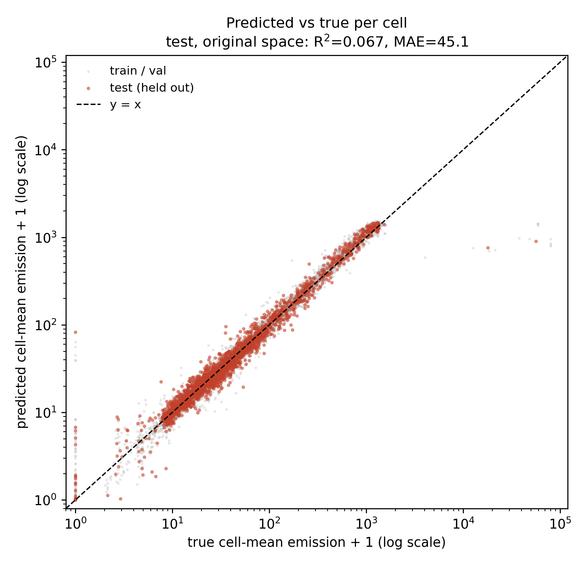
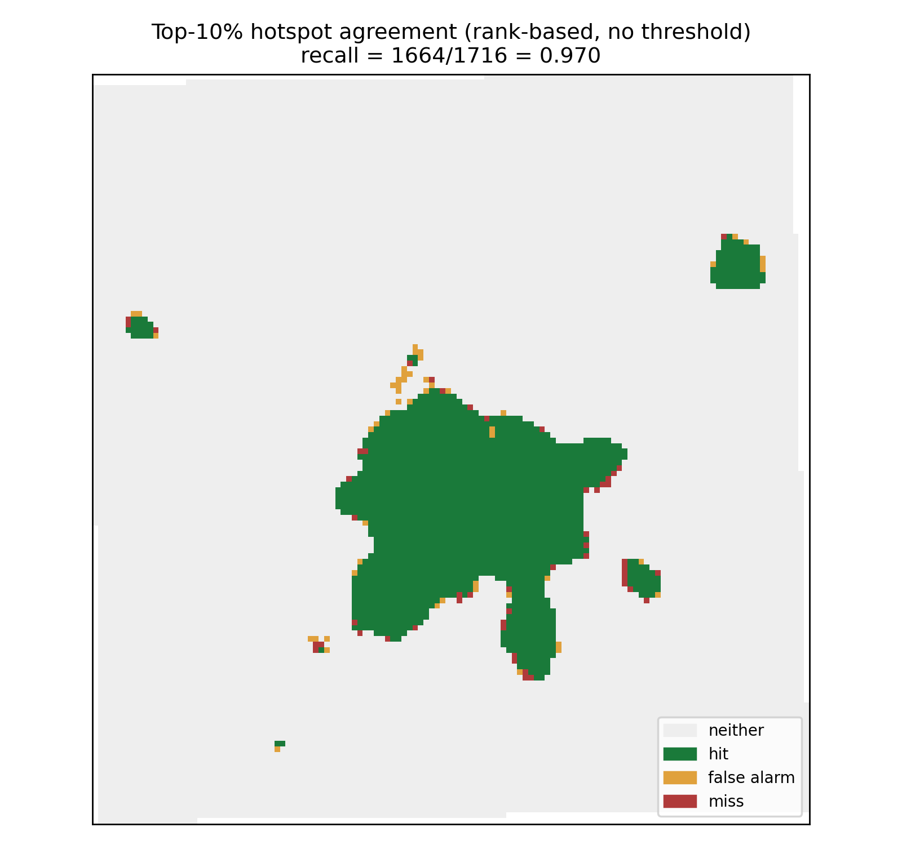

# 🛰️ MS-CA: Continuous Carbon Emission Prediction Using Satellite Proxy Data

[](#)
[](https://www.python.org/)
[](https://pytorch.org/)
[](LICENSE)

> **A dual-stream cross-attention Vision Transformer that maps carbon emissions from 7 satellite proxies — proving that spatial context, not model capacity, is the decisive signal.**

<p align="center">
  
  <br/>
  <em>Ground truth vs. MS-CA prediction vs. residual on <strong>strictly held-out</strong> test cells (36-month means, p99-clipped). The urban core, radial corridors, and satellite towns are reproduced on cells never seen in training.</em>
</p>

---

## 📌 Overview

Physical carbon monitoring (flux towers, in-situ sensors) is accurate but **expensive and spatially sparse**, leaving most of any city's grid unmeasured. Conventional proxy models predict each 1×1 cell in isolation and hit an **informational ceiling**, because emission is not a local quantity but a **spatial field** — plumes disperse downwind and traffic follows the road network.

**MS-CA** overcomes this ceiling by reading a **16×16 neighborhood** around each cell and fusing two physically distinct streams — atmospheric pollution and socio-infrastructure — via **cross-attention**. Under strictly leakage-controlled evaluation, this raises held-out log R² from **0.757 → 0.960 (+0.203)**, an **83% reduction in unexplained variance** — a cost-effective *virtual sensor network* from public satellite data.

---

## ✨ Key Features

* **🧩 Dual-Stream Cross-Attention Fusion** — Stream B (socio-infrastructure) forms the Query; Stream A (pollution) forms Key/Value, framing prediction as *emission attribution* to infrastructure.
* **🔒 Two-Layer Leakage Control** — a **cell-fixed split** removes location-identity leakage (ICC = 0.9915); a **buffered block split** (buffer 16) forces train/test patch overlap to zero.
* **📐 Skewness-Aware Design** — a `log1p` target and **rank-based metrics** correctly handle a target with skewness ≈ 40, where the top 1% of cells dominate the raw variance.
* **🔬 Controlled Ablation** — a `center_only` mode isolates *spatial context* from *model capacity*, proving where the gain comes from.
* **♻️ Reproducible by Construction** — each checkpoint embeds its split and normalization, so evaluation/inference reconstruct the identical held-out set.

---

## 🏗️ System Architecture

The system separates a **leakage-controlled training/evaluation pipeline** from the **MS-CA model architecture** itself.

### 1️⃣ Training & Evaluation Pipeline

<!-- Paste the Mermaid training-pipeline diagram here, or embed figures/pipeline_training.png -->


Cell-fixed splits eliminate location-identity leakage; the block split is a robustness check; the target is `log1p`-transformed and features are standardized on **train cells only**.

### 2️⃣ MS-CA Model Architecture

The **MS-CA Model** block above expands into the dual-stream network below:

<!-- Paste the Mermaid architecture diagram here, or embed figures/pipeline_architecture.png -->


Stream B forms the query and Stream A the key/value, so the model attributes pollution signals to the surrounding infrastructure structure — a data-dependent, pairwise interaction that a fixed-weight MLP cannot represent.

---

## 📊 Main Results

All metrics are on **strictly held-out test cells** (cell-fixed split, log space).

### Ablation — Context, not Capacity

| Condition | Information | log R² | Top-10% recall |
|---|---|:--:|:--:|
| B3 — GBM, 1×1 | center cell only | 0.7567 | 0.820 |
| MS-CA, center-only | center cell only | 0.7450 | 0.824 |
| **MS-CA, full 16×16** | **center + neighborhood** | **0.9595** | **0.952** |

> With the neighborhood zeroed, the transformer converges to the single-cell ceiling on **both** metrics (0.745 ≈ 0.757; 0.824 ≈ 0.820). The **+0.203** gain appears **only** when the 16×16 context is restored — the decisive variable is **spatial context, not model capacity**.

### Rank-Based Validation (heavy-tail-appropriate)

| Metric | Held-out value | Interpretation |
|---|:--:|---|
| **Spearman ρ** | **0.978** | Spatial ordering of the emission field is recovered |
| **Top-10% recall** | **0.952** | 95% of true super-emitter hotspots identified (threshold-free) |
| log-space R² | 0.960 | Primary accuracy metric (natural scale for a multiplicative process) |
| original-space R² | 0.067 | Dominated by the top-1% tail — see the defense below |

<p align="center">
  
  
  <br/>
  <em>Left: predicted vs. true per cell across five orders of magnitude. Right: rank-based top-10% hotspot agreement (hit / false alarm / miss).</em>
</p>

> **🛡️ On the original-space R² (0.067) — a property of the target, not the model.**
> With skewness 40, the raw-scale variance is owned by the top 1% of cells, so original R² degenerates into a squared-error score over a handful of super-emitters; a uniform ±30% multiplicative error grows as *(y·δ)²* and collapses raw R², while **rank metrics — the correct indicators here — stay high**. Stratified MAE confirms this: ≤ 106 below the 99th percentile vs. 2,929 within the top 1% (MedAE = 3.2). Inaccuracy is confined to the absolute magnitude of the extreme tail, not the emission field.

---

## 🛠️ Installation

Requires Python 3.10+ and (recommended) a CUDA-capable GPU.

```bash
git clone https://github.com/subinidus/msca-carbon.git
cd msca-carbon
pip install -r requirements.txt
```

`lightgbm` and `wandb` are optional (the B3 baseline falls back to scikit-learn's `HistGradientBoostingRegressor`; training runs with `--disable_wandb`). Place the 36 monthly `.npz` tensors under `data/` — see [`data/README.md`](data/README.md) for the schema.

---

## 🚀 Usage / Quick Start

```bash
cd src
DATA="../data/ms_mca_tensor_delhi_ncr_*.npz"
```

**1. Diagnostics** — justifies the transform and split design:
```bash
python diagnostics.py --data_path $DATA --save_json ../outputs/diag.json
```

**2. Baselines** — run first; B1 checks whether the task reduces to locating plants:
```bash
python baselines.py --data_path $DATA --split_mode cell \
    --target_transform log1p --seed 42 --save_json ../outputs/baselines_cell.json
```

**3. Train MS-CA** — cell-fixed split, log1p target:
```bash
python train.py --data_path $DATA --output_dir ../checkpoints/ckpt_cell \
    --split_mode cell --target_transform log1p \
    --epochs 50 --batch_size 512 --use_amp --seed 42 --disable_wandb
```

**4. Evaluate** — split & normalization restored from the checkpoint:
```bash
python evaluation.py --checkpoint ../checkpoints/ckpt_cell/best_model.pth \
    --data_path $DATA --smearing --bootstrap 1000 --save_json ../outputs/eval_cell.json
```

**5. Inference & Figures** — full-grid map and publication figures:
```bash
python inference.py --checkpoint ../checkpoints/ckpt_cell/best_model.pth \
    --data_path $DATA --output_dir ../outputs/inference
python make_figures.py --inference_dir ../outputs/inference \
    --baselines_json ../outputs/baselines_cell.json --output_dir ../figures
```

<details>
<summary><strong>Ablation & robustness commands</strong></summary>

```bash
# center-only: architecture held constant, spatial context removed
python train.py --data_path $DATA --output_dir ../checkpoints/ckpt_center \
    --split_mode cell --context center_only --target_transform log1p \
    --epochs 50 --batch_size 512 --use_amp --seed 42 --disable_wandb

# block split (buffer 16): zero train/test patch overlap
python train.py --data_path $DATA --output_dir ../checkpoints/ckpt_block \
    --split_mode block --buffer 16 --target_transform log1p \
    --epochs 50 --batch_size 512 --use_amp --seed 42 --disable_wandb
```
</details>

---

## 📂 Repository Structure

```
msca-carbon/
├── src/
│   ├── model.py                # MSCANet: dual-stream ViT + cross-attention
│   ├── spatial_grid_dataset.py # log1p target, train-only norm, context ablation
│   ├── splits_v2.py            # leak-aware splits: cell / block(buffer) / random
│   ├── fast_data.py            # GPU-resident patch batcher (bit-identical, faster)
│   ├── metrics.py              # both-space metrics, rank stats, Duan smearing
│   ├── train.py                # training with guarded model selection
│   ├── evaluation.py           # rebuilds the exact split from the checkpoint
│   ├── inference.py            # full-grid inference → CSV / NPZ / JSON
│   ├── baselines.py            # B0–B3 on the identical split
│   ├── diagnostics.py          # ICC / skew / lag / static-feature audit
│   └── make_figures.py         # publication figures + results tables
├── data/                       # NOT tracked; see data/README.md
├── figures/                    # result figures
├── requirements.txt · pyproject.toml · LICENSE
```

---

## 🧭 Reflections & Limitations

* Single region (Delhi NCR), 36 months, single seed — multi-seed confidence intervals are in progress.
* 30–45% relative error on the largest emitters; the regional total is underestimated (Jensen bias under log-training, partially corrected by Duan smearing).
* These limitations are **disclosed, not concealed**, and none affects the rank-based conclusions.

---

## 👨‍💻 Author & Citation

**Subin Seo** — Dept. of Computer Science (AI Computing), Kyungpook National University
📧 subin1107@knu.ac.kr · 🔗 [github.com/subinidus](https://github.com/subinidus)

```bibtex
@misc{seo_msca_carbon_2026,
  author = {Seo, Subin and Lee, Jewon and Payyapilly, Rhea Tess and Mathew, George K.},
  title  = {MS-CA: Continuous Carbon Emission Prediction Using Satellite Proxy Data},
  year   = {2026},
  note   = {Best Poster Award, Climate AI Workshop}
}
```

## 📜 License

Released under the [MIT License](LICENSE).
